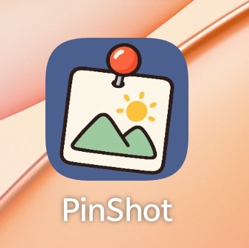
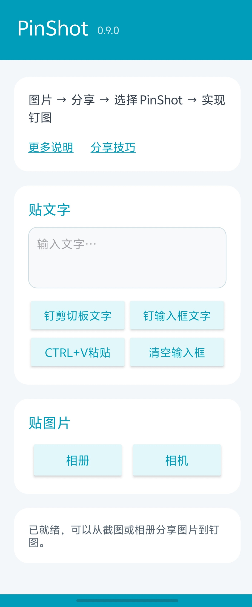

# PinShot

[English](README.en.md) | 简体中文

<div align="center">
  
</div>

**PinShot 是一款 Android 悬浮钉图工具。** 把图片或文字固定在屏幕上方，切换到其他应用时也能随时查看。

## 界面预览

<div align="center">
  
</div>

## 功能

- **钉图**：从相册选择图片、拍照，或从其他应用分享图片给 PinShot；选图和裁剪后即可悬浮显示。
- **钉文字**：把剪切板文字或输入框中的文字生成悬浮便签。
- **拖动与缩放**：拖动图片移动位置，拖动右下角手柄等比例缩放；图片可以部分移出屏幕边缘，之后仍可拖回。
- **图片操作**：双击悬浮图可关闭当前图或关闭所有图，也可逆时针旋转、保存到相册或通过系统分享面板分享。
- **多图悬浮**：再次分享图片会新增一张悬浮图，现有图片继续保留。
- **分享教程**：应用内提供 OriginOS 图片分享面板的设置指引。

## 使用方法

### 分享图片钉图

1. 在相册、截图预览或其他应用中选择图片，点击系统的“分享”。
2. 在分享面板选择 **PinShot**。
3. 图片处理期间会显示转圈提示，完成后直接悬浮在相册上方；首次使用时需先允许 PinShot“显示在其他应用上层”。

也可以从 PinShot 首页点击“相册”选图，或点击“相机”拍照。确认照片后可在裁剪页面调整范围，点击右上角 ✓ 钉图。

### 钉文字

- **钉剪切板文字**：读取剪切板中的文字并直接钉到屏幕上。
- **钉输入框文字**：把输入框中的文字钉到屏幕上。
- **CTRL+V粘贴**：将剪切板文字粘贴到输入框。
- **清空输入框**：清除输入内容。

### 操作悬浮图

- 单指拖动图片可移动悬浮图。
- 拖动右下角手柄可等比例放大或缩小。
- 双击图片打开操作菜单，可关闭当前图、关闭所有图、逆时针旋转、保存或分享。
- 再次分享可以继续添加悬浮图。

## 系统要求

- Android 11（API 30）或更高版本。
- 编译与目标 SDK：Android 16（API 36）。

## 构建

需要 Android Studio 和 JDK 17。克隆项目后，在 Android Studio 中打开项目并等待 Gradle 同步，然后运行 `app` 配置即可安装到已连接的设备。

也可以在项目根目录运行：

```bash
./gradlew :app:assembleDebug
```

APK 输出位置：`app/build/outputs/apk/debug/app-debug.apk`。

## 权限与隐私

PinShot 需要“显示在其他应用上层”权限来显示悬浮图片和文字。应用通过系统分享内容或系统选图流程读取用户选中的图片；不需要无障碍服务、屏幕录制权限或相册全量访问权限。

## 版本

当前项目版本：**1.0.0**。
